# Using Multiple AI Tricks to Brainstorm Valid Research Topics

A friend of mine wants to write a paper. They don't have the paper yet. What they have is the step before it: the part where you figure out what's worth writing about. They walked me through how they'd go about finding one, and halfway through I stopped listening like a friend and started listening like an engineer. That isn't a process, I thought. That's a prompt. I could hand that exact description to an agent, give it the AgentCore Web Search and Runtime tools we've built at AWS to go find the literature, and bolt on my favorite underappreciated tool, ideonomy, to push past the obvious ideas once it found a hole. (Ideonomy was Patrick Gunkel's decades-long attempt to turn coming up with ideas into a science. More on him below.)

Less than 24 hours later I had a Mac app. It's called **Academic Noosphere**, it's open source under MIT, and this post walks through how to use it, with screenshots from a real run. Then it gets into the two problems worth writing up: getting a PyTorch model into a signed Mac app without shipping PyTorch, and wiring ideonomy into an LLM without letting it make things up.

The name is borrowed from Eric S. Raymond. In 1998 he published [*Homesteading the Noosphere*](http://www.catb.org/~esr/writings/homesteading/homesteading/), the essay that explained how open-source hackers stake claims to projects nobody owns yet. His noosphere is the territory of ideas, and his hackers were homesteaders on it, looking for unclaimed land. Academic research runs on the same instinct. You're looking for the plot nobody has built on yet. This app is the surveyor.

## What it actually does

Every paper you've ever read has a sentence like "to our knowledge, no prior work has examined X." Think about how that sentence gets written. Nobody reads 8,000 papers. You read the forty your advisor mentioned, the ten Google Scholar ranked highest and whatever landed in your feed that week, and then you make a claim about everything you *didn't* read. Most of the time it's true. Nobody checks.

Noosphere checks. You give it a **Field**, say "memory for AI agents," and a handful of seed queries, and it:

1. **Surveys the field.** It pulls roughly 8,000 papers from OpenAlex, follows the citations outward, and embeds every abstract with a language model trained on scientific papers so it can keep the ones that are actually on topic.
2. **Builds a graph** of works, authors, topics and citation edges, stored locally on your Mac.
3. **Finds whitespace:** regions of that graph that look emptier than they should.
4. **Zooms in** on the whitespace you pick and checks it three different ways before it's allowed to call anything a gap.
5. **Writes a Gap Report** where every sentence cites its sources inline.
6. **Suggests ways to fill it, with ideonomy.** This is the new part, and it runs on a tool I'll personally vouch for. Those ideas stay in their own clearly labeled speculative section, apart from the grounded findings.

If you grew up on strategy games instead of open-source essays, it's the same picture. The map starts out covered in fog. You send scouts out and the terrain fills in, and after a while you notice a patch in the middle of well-explored territory that nobody has walked into. That patch is interesting, and it's either an opportunity or a trap. Noosphere draws the map, points at the patches, and makes you show your evidence before you plant a flag.

I hold the whole app to the rule every good advisor holds their students to:

> If you can't point to the paper, you don't get to say it.

Every claim in a report carries a DOI, an OpenAlex ID or a dated web link. Anything that can't gets moved into a section with *speculative* stamped across the top. The facts come from scholarly databases, not from whatever the model half-remembers. Claude only gets to write the summary, and it has to cite its sources when it does.

## Getting it running

The easy path is the signed, notarized `.dmg` from [GitHub Releases](https://github.com/jacksodj/academic-noosphere/releases). v0.3.0 is the current release, and you'll need an Apple Silicon Mac. If you'd rather build it yourself:

```bash
git clone https://github.com/jacksodj/academic-noosphere.git
cd academic-noosphere
uv sync --extra embed --extra websearch
cd app && npm install && npx tauri build
```

### Bring your own keys

The app ships with no credentials and never will. The first time you open it, an onboarding wizard walks you through what it needs:

- **A contact email.** OpenAlex and Crossref move requests that include one into a faster "polite pool." No signup.
- **An OpenAlex API key.** It's free, and it matters more than it looks. A survey pulls gigabytes of metadata, and anonymous clients get pushed to the back of the line and eventually rate-limited, sometimes for hours. With a key and an email you stay in the fast lane. The app warns you if you try to start a survey without them.
- **An optional Semantic Scholar key** for enrichment. There's also an NCBI key slot that v1 doesn't use yet; PubMed support is on the roadmap.
- **AWS credentials** for Bedrock, which is how the app calls Claude. It checks that you actually have access to the models before you start, because finding that out forty minutes into a survey is miserable.
- **The embedding model**, a one-time ~418 MB download. More on that below.

All of it goes into the macOS Keychain. Nothing lands in a file or in the repo.

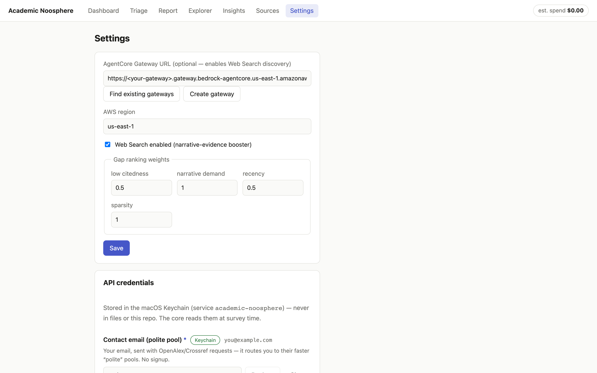

Settings is where you tune things afterward, and the **gap-ranking weights** are the part worth understanding. Every gap gets a composite score from four components: sparsity, narrative demand, recency and low citedness. The weights are right there and you can change them. If you care more about gaps the authors themselves are complaining about than gaps that only show up in the math, turn up *narrative demand*.

**Web Search is optional.** If you have an AWS account, the app will find or create an AgentCore Gateway for you with one button and use it to discover papers the citation graph missed. Without it, everything runs off the scholarly APIs.

## Your first survey, start to finish

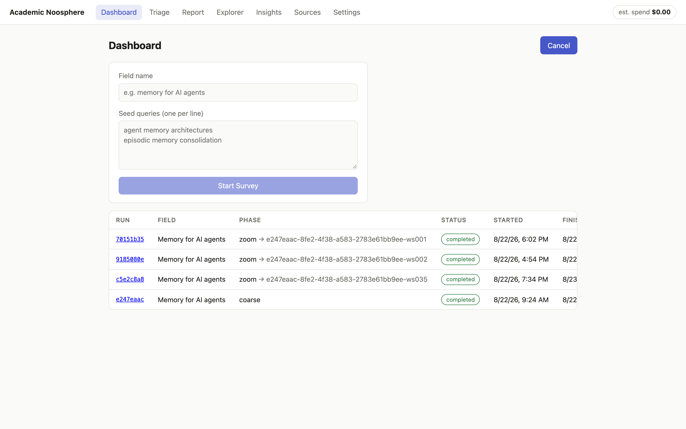

On the Dashboard, click **New Survey**, name your field and give it a few seed queries, one per line. My first run was "memory for AI agents," seeded to cover both sides of that intersection: agent memory architectures on one side, and human memory science (episodic memory, consolidation, forgetting) on the other.

Then go do something else. A coarse survey is a real job; mine ran for several hours. It checkpoints as it goes, so you can close the lid and it picks up where it stopped.

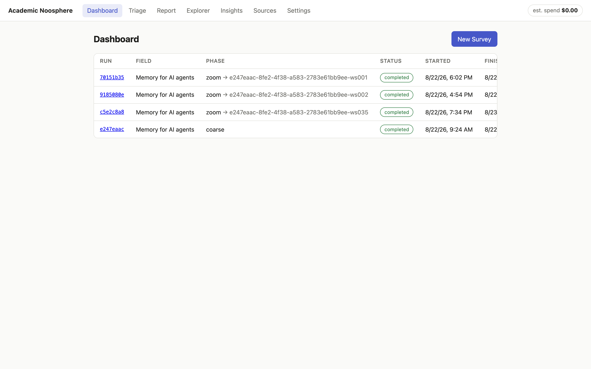

Click into a run and you can watch it work:

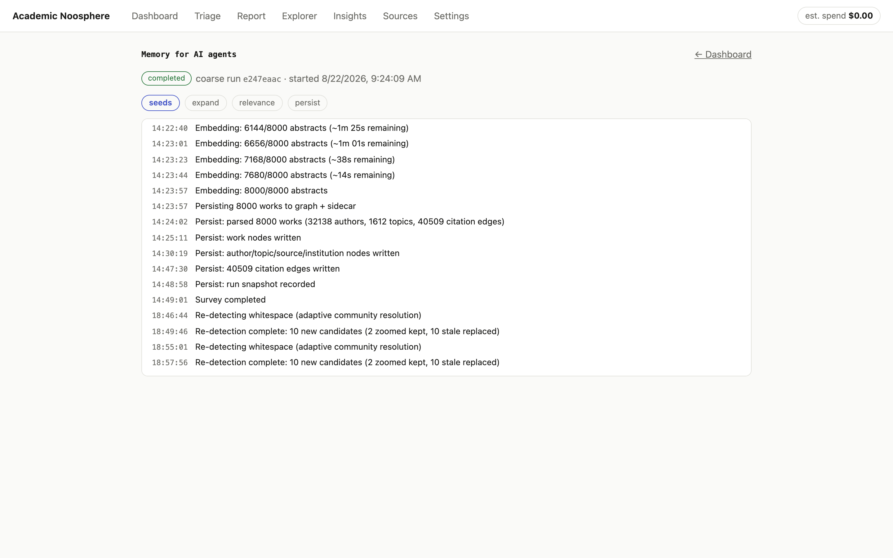

That's my actual first run: 8,000 abstracts embedded, and 32,138 authors, 1,612 topics and 40,509 citation edges written to the graph. The meter in the header tracks what the LLM calls are costing you, live, so there are no surprises on the bill.

### Triage: where's the fog?

When the coarse pass finishes, **Triage** lists the Whitespace Candidates, most surprising first:

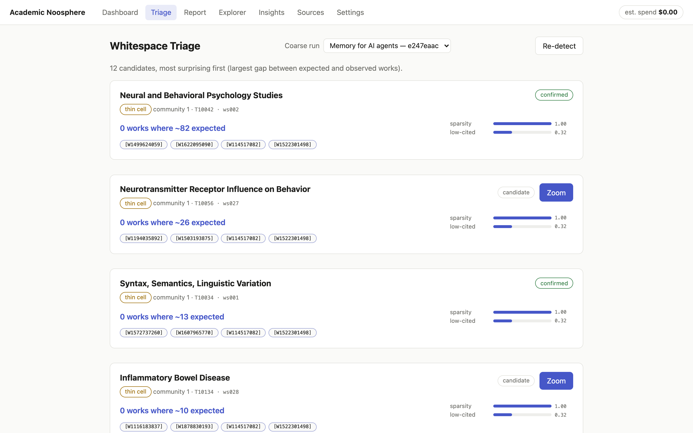

"0 works where ~82 expected" is the whole idea in five words. The app clusters the citation graph into communities and cross-tabulates them against OpenAlex topics. When a topic is common across the corpus but completely missing from a community where the math says you'd expect around 82 papers on it, that's a **thin cell**. The other kind of candidate is a **bridge**: two communities whose papers sit close together in meaning but almost never cite each other. The ideas are neighbors. The people don't talk.

Every candidate shows its evidence as clickable OpenAlex IDs, and you decide which ones deserve the money. **Zoom** is the button that spends it.

### Zoom: is the quiet real?

A zoom run pulls in more papers around the candidate and asks three questions:

1. **Does the sparsity survive a closer look?** If more data fills the hole, it was never a hole.
2. **Is anyone asking for it?** Are authors in the region actually writing "future work should examine…" or "it remains unclear whether…"?
3. **What's the history?** Did the area never start, go quiet, or is it just emerging?

Candidates that pass become **Gaps**. The ones that don't are listed as "examined, not confirmed," and the app shows you those too. A gap-finder that hides its misses is just a more confident way of not checking.

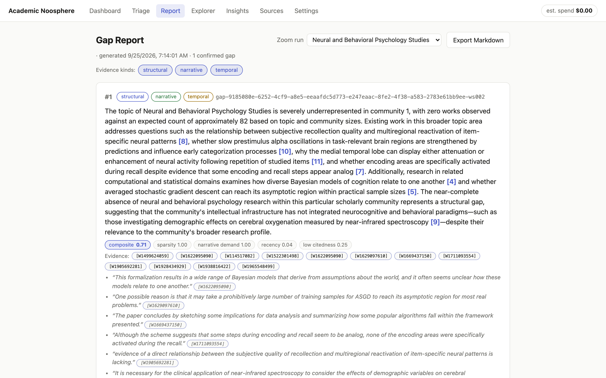

Here's the Gap Report. Every bracketed number links to a source paper. The quotes underneath are the authors' own words about what they didn't know, like "evidence of a direct relationship between the subjective quality of recollection and multiregional reactivation of item-specific neural patterns is lacking." That's narrative demand, and every quote is pinned to a work ID so you can go read it in context.

**Export Markdown** gives you a document you can cite from. There's a [complete real example in the repo](https://github.com/jacksodj/academic-noosphere/blob/main/docs/examples/gap-report-example.md).

### Expand: now you're allowed to speculate

Under each gap sits a collapsed panel labeled **SPECULATIVE**. Click **Expand (Opus)**:

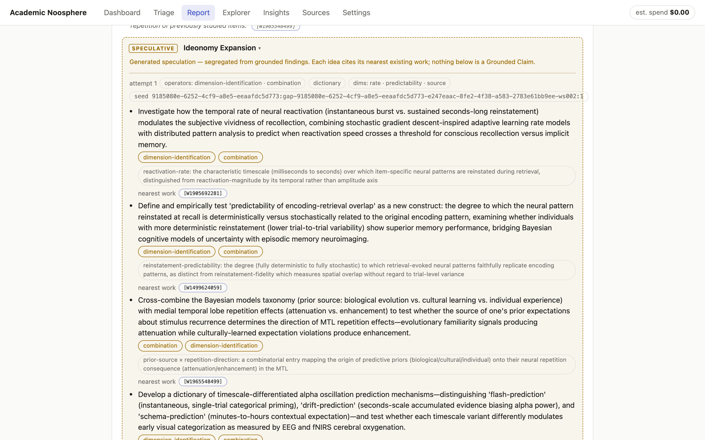

Every idea is tagged with the ideonomic operators that produced it and the **nearest existing paper**, so you can see what's already been done next door. **Re-roll** draws a different method combination. How that works is further down.

### Explore the map

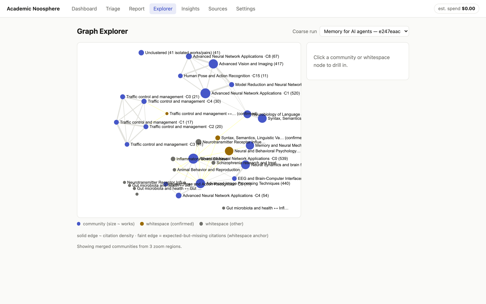

The Explorer is the literal map. Blue nodes are citation communities, sized by how many papers they hold. Gold nodes are confirmed whitespace. The faint yellow lines are citations the math says *should* exist and don't. Click any node to drill in:

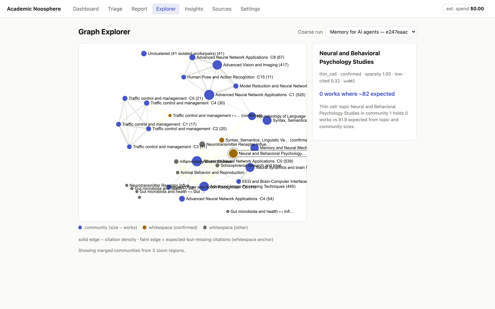

### Insights and Sources: check the scouts

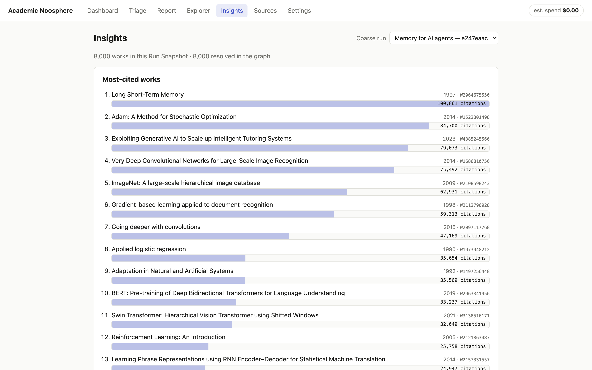

**Insights** and **Sources** are the sanity checks: the most-cited works, the most active recent areas, the publication-year spread, and a searchable list of all 8,000 papers. They're also where you catch the tool being wrong about your field, which I'll get to.

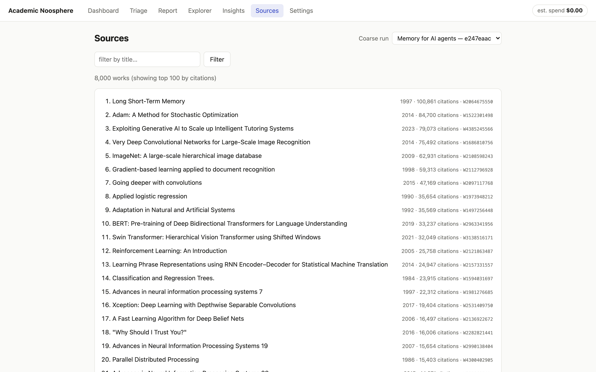

## Getting PyTorch out of a Mac app

The relevance filter is what separates a useful survey from a pile of junk, and it runs on **SPECTER2** (`allenai/specter2_base`), a model trained on scientific citations so that papers that cite each other land close together in vector space. It's also a PyTorch model, and shipping PyTorch inside a Mac app means a multi-gigabyte bundle, a slow cold start and a dependency tree that makes code signing miserable. I wanted a `.app` you double-click, not a README that starts with "first, install conda."

So the model had to move to **ONNX Runtime**: one portable model file and a small runtime, no torch.

The catch: by the time I got to packaging, the graph already held thousands of vectors the PyTorch model had produced. If the ONNX version produced even slightly different vectors, every similarity score would quietly drift, and old and new embeddings would stop being comparable. Re-embedding everything wasn't an option, so I set a hard rule:

> The port ships only if it produces the same vectors as the original, to five nines of cosine similarity. Otherwise it doesn't ship.

### The parity gate

`scripts/export_specter2_onnx.py` does the whole job in one self-contained script you can `uv run`:

1. **It loads the original PyTorch model** exactly the way the app always had. That's the *oracle*.
2. **It checks the pooling recipe.** SPECTER2 averages its token vectors over the attention mask. The script reads that from the model's config and refuses to continue if it says anything else, because a wrong pooling assumption gives you vectors that *look* fine and are wrong.
3. **It exports only the transformer body** to fp32 ONNX (opset 17), with dynamic batch and sequence sizes. Pooling and normalization happen in plain NumPy on the other side, which keeps the exported graph simple and the math where you can see it.
4. **It writes a `recipe.json`** with the max sequence length, pooling mode, normalization, embedding size and the SHA-256 of the model file.
5. **It runs the gate.** It rebuilds the embedder from scratch on the ONNX file and compares it with the oracle on 110 texts: 100 real abstracts sampled from OpenAlex, plus ten deliberately nasty ones, including a single character, Japanese text, and a string long enough to hit the 512-token limit.

The result:

| Metric | Value |
|---|---|
| Texts compared | 110 |
| Minimum cosine similarity | **0.99999982** |
| Max per-component difference | 2.98 × 10⁻⁷ |
| Threshold | 0.99999 |
| Verdict | **PASSED** |

Three ten-millionths is floating-point noise. Old torch vectors and new ONNX vectors share one graph.

### Shipping it

The app itself doesn't include the model. The ~418 MB artifact lives on Hugging Face at [`jacksodj/specter2-base-onnx`](https://huggingface.co/jacksodj/specter2-base-onnx) and downloads on first launch, with a few guard rails:

- `recipe.json` comes down **first**, because it carries the checksum.
- `model.onnx` is checked against that checksum **as it streams**.
- Every file lands as a `.part` and is renamed only when it's complete, so a killed download can never leave behind half a model the app would trust.

Behind one interface, the app tries three embedders in order: ONNX if the artifact is there, sentence-transformers if you're a developer with torch installed, and a deterministic stub, with a loud warning, if neither is. The packaged result is a **244 MB, torch-free** Python core inside a signed, notarized `.app`.

## Ideonomy, on a leash

Finding the gap is only half of my friend's problem. The other half is figuring out what to do with it, and that's where ideonomy comes in.

[Ideonomy](https://ideonomy.mit.edu/) is the "science of ideas" Patrick Gunkel (1947–2017) spent his working life building: named operations you can apply to an idea on purpose (negate it, substitute a piece of it, lift it to a higher abstraction, lay it out as a tree or a spectrum) instead of waiting for inspiration to strike. Ask a model for ideas and you get the most probable ones, which are the ones everybody already had. Ideonomy forces a method instead. You don't say "give me ideas." You say "apply **substitution** and **tree-finding**, structured as a **graph**, probed along **scope**, **cardinality** and **reversibility**," and the model has to go somewhere it wouldn't have gone on its own.

Brainstorming on a product is one thing. Brainstorming inside a tool whose whole promise is *nothing unlabeled, nothing uncited* is another, so the interesting problem here was the leash.

### How it's wired

I didn't write the method catalog. It's vendored from [latentwill/ideonomy-skill](https://github.com/latentwill/ideonomy-skill), which adapts [Grace Kind's essays on ideonomy](https://gracekind.net/writing/ideonomy/) into something a machine can use (CC-BY-4.0), pinned to upstream commit `3339f3e` with a sync script so updates are deliberate. It has **8 operators**, **17 organons** (output structures: a tree, a matrix, a timeline, a periodic grid and so on) and **29 dimension-prompts** (age, reversibility, symmetry, predictability, scope, rate and more).

For each expansion the app draws a **method tuple**: 2 operators, 1 organon and 3 dimension-prompts, about 20,000 possible combinations. The draw is **seeded** from `run_id : gap_id : attempt`, so it's random but reproducible. Run it again and you get the same tuple; hit **Re-roll** and the attempt number goes up by one, which gives you a new tuple that's just as reproducible. A speculative idea you can regenerate on demand is much easier to trust than one you can't.

### The leash

Here's what keeps it from turning into a hallucination engine:

1. **The model only sees what it's allowed to cite:** the gap statement, its evidence, the titles and opening lines of the nearest works, and the full text of the picked methods. Nothing else.
2. **The output has to be strict JSON.** Every idea has `text`, `operators`, `organon_position` and `nearest_work_id`.
3. **Anything that breaks the rules gets dropped, quietly.** Claim an operator outside the tuple, cite a paper outside the provided set, or skip the organon position, and the idea is gone. The model can't cite its way out of the fence.
4. **Whatever survives renders in its own dashed, gold-bordered box** labeled *SPECULATIVE*, with a line saying nothing inside is a Grounded Claim.

In the screenshot above, the tuple was *dimension-identification + combination × dictionary × rate / predictability / source*. One of the ideas it came back with: define "predictability of encoding-retrieval overlap" as a new construct (how deterministically the brain reinstates a memory's neural pattern when you recall it), and test whether people with more deterministic reinstatement remember better. It cites its nearest existing work, a 2008 chapter on encoding-retrieval overlap in episodic memory.

Is that a good idea? I have no idea. I'm not a neuroscientist. But it's a *specific* idea, it came from a named method, and it tells me exactly which paper to read first to find out whether somebody already did it.

> Ideonomy doesn't make the model smarter. It makes the model go somewhere new, and then makes it tell you where it went.

### Use it without Noosphere

You don't need this app to get ideonomy into your own agent, and you should try it on its own. The same catalog ships as a pair of agent skills in the [latentwill/ideonomy-skill](https://github.com/latentwill/ideonomy-skill) repo: `ideonomy-plain` for anywhere text goes, and `ideonomy-rich` for terminals that can handle the ASCII art. Load one into your agent and every brainstorm starts by rolling a random method tuple, then runs the operators out loud, so you can see which move produced which idea. It works with Claude Code and any agent that loads skills from a folder. In Claude Code it's two commands:

```bash
/plugin marketplace add latentwill/ideonomy-skill
/plugin install ideonomy@ideonomy
```

Or clone the repo and copy the skill folder into your agent's skills directory. It's plain bash and markdown, with no build step. I use it for a lot more than paper topics.

## Check the corpus before you trust the gaps

Go back and look at the Insights screenshot. The most-cited works in a survey of "memory for AI agents" include LSTM (fair), Adam (fine), and then ImageNet, VGG, "Going deeper with convolutions" and a Swin Transformer paper. The Explorer has five separate communities labeled *Traffic control and management*. That's not agent memory. That's the scouts wandering off the map.

It's called **corpus drift**, it's a known v1 limitation, and it comes from two places. First, following citations pulls in the classics, because every deep-learning paper cites ImageNet. Second, the relevance filter is generous. A paper stays in if its embedding is close enough to your seeds (cosine ≥ 0.35) **or** if it shares *any* OpenAlex topic with *any* seed paper. One seed tagged with something broad like "Advanced Neural Network Applications" is enough to let the classics walk right in.

Drift doesn't make the gaps fake, but it changes what they mean. The confirmed gap in my report, "Neural and Behavioral Psychology absent from community 1," is real in the graph. But community 1 is partly built out of drifted papers, which is why Adam and SGD show up in its evidence.

What to do about it:

1. **Write narrow seed queries.** "Episodic memory consolidation in LLM agents" beats "memory." Broad seeds bring broad topics, and broad topics open the filter.
2. **Open Insights and Sources before you open Triage.** If the most-cited list doesn't look like your field, the gaps won't either. Fix the corpus first.
3. **Raise the threshold if you have to.** In v1 the relevance threshold and corpus size aren't in the Settings screen yet. They live in `~/Library/Application Support/academic-noosphere/settings.json` as `relevance_threshold` (default `0.35`) and `coarse_corpus_target` (default `8000`). Raise the threshold and start a new survey.
4. **Read the component scores.** A gap with high sparsity and zero narrative demand is a hole nobody's asking about. That might be an opportunity. It might just be drift.

## The code, and what's worth stealing

Everything is at **[github.com/jacksodj/academic-noosphere](https://github.com/jacksodj/academic-noosphere)** under MIT. The vendored ideonomy catalog keeps its own CC-BY-4.0 license, crediting Grace Kind and Patrick Gunkel.

```
┌─────────────────────────── macOS ────────────────────────────┐
│  Tauri shell (Rust)                                          │
│  └─ React + TS SPA ── HTTP/SSE (localhost, per-launch token) │
│                              │                               │
│  Python core (frozen sidecar, FastAPI)                       │
│  ├─ Survey job queue (async, checkpointed, resumable)        │
│  ├─ Discovery ── MCP/SigV4 ──► AgentCore Gateway ► Web Search│
│  ├─ Resolution: OpenAlex · Semantic Scholar · Crossref       │
│  ├─ LadybugDB graph (embedded Cypher) + DuckDB sidecar       │
│  ├─ SPECTER2 embeddings (ONNX Runtime)                       │
│  ├─ Synthesis: Bedrock — Opus for gaps + ideonomy,           │
│  │             Haiku for volume extraction                   │
│  └─ Ideonomy engine (vendored catalog + seeded picker)       │
└──────────────────────────────────────────────────────────────┘
```

A few decisions I'd steal for anything similar:

- **Discovery is not resolution.** Web Search is only used to *find identifiers*: titles, DOIs, URLs. Snippet text is never stored. The graph comes entirely from scholarly APIs, and every node and edge traces back to a DOI or OpenAlex ID. That's partly good epistemics and partly Web Search's acceptable-use terms, which don't let you build a database out of search results. For once, the constraint and the right design were the same thing. (The spike that proved Web Search had the coverage cost **$2.11**.)
- **Run Snapshots.** Every survey records the exact set of papers its analysis was computed over, and reports are checked against it. If a report cites a paper the run never saw, that's a failure, not a footnote.
- **Local orchestration, cloud services.** It isn't local-only, and it isn't a cloud agent either. The data comes from scholarly APIs, synthesis runs on Claude Opus and Haiku through Bedrock, and discovery goes through an optional AgentCore Gateway. What runs on your Mac is the part that decides: the job queue, the citation graph, the embeddings and your credentials. The Runtime I pictured at the start never made it in. Once the pipeline was a checkpointed job queue, a Python process on the laptop turned out to be enough.
- **A per-launch token.** The Python core binds to localhost on a random port and hands a one-time token to the Rust shell. Nothing else on your machine can drive it.

### How long it took, and why you should care

From an empty repo to a working Mac app with a real survey finished took less than a day. The signed, notarized release took the rest of the week. I'm not bragging, well, not only bragging. If you want a different version (another field, other sources, your own definition of a gap), that's the useful part: building your own is days of work, not a quarter.

| Elapsed | Milestone |
|---|---|
| ~2 hours | Empty repo → every architecture decision made and the spec locked |
| Same night | Build contracts, then modules built in parallel, then the full pipeline wired end to end (136 tests passing) |
| < 24 hours | Mac app shell running, and the first real 8,000-paper survey completed |
| Day 4 | Self-contained signed `.app` with the ONNX embedder, no PyTorch |
| Day 5–6 | Guided onboarding, v0.3.0 notarized release, fixes from real use |

Two things made that pace possible, and you can reuse both:

- **Decisions live on the issue tracker, not in anyone's head.** Issue #1 is a "wayfinder map," and every architectural question became its own ticket with explicit `Blocked by:` lines, decided and closed with a written resolution before any code existed. [`docs/architecture.md`](https://github.com/jacksodj/academic-noosphere/blob/main/docs/architecture.md) is the spec assembled from those tickets, and [`CONTEXT.md`](https://github.com/jacksodj/academic-noosphere/blob/main/CONTEXT.md) is the glossary. If you want to know *why* something works the way it does, the answer is in a closed ticket.
- **Claude agents did the building, in parallel, from that spec.** Build contracts first, then independent modules built at the same time, then integration. Every commit is co-authored by Claude. Which means a customization is just another ticket: write down the decision and point an agent at it.

If you're customizing, here are the seams:

- **Field and seeds:** no code at all, it's the New Survey form.
- **What counts as a gap:** `src/noosphere/analysis/whitespace.py` finds candidates, `confirm.py` runs the three checks, `ranking.py` does the composite score.
- **Prompts:** `src/noosphere/llm/prompts.py` for gap statements and narrative extraction, `src/noosphere/ideonomy/expand.py` for ideonomy.
- **Data sources:** `src/noosphere/sources/`. Adding arXiv or PubMed means adding one resolver there.
- **Ideonomy methods:** point `scripts/sync_ideonomy.py` at your own fork of the catalog.

The whole codebase is small enough to hold in your head: about 5,900 lines of Python and 4,900 of TypeScript, with ~200 tests (`uv run --group dev pytest`).

## Go break it

Download it, point it at a field you know cold, and look at what it finds. The best test of a gap-finder is somebody who already knows where the gaps are, so if it's wrong about your field, I want to hear about it.

It was never meant to replace reading. It's meant to make "to our knowledge, no prior work has examined X" a sentence you can check, with the receipts attached. Writing the paper is still my friend's job. Finding where to start digging doesn't have to be.

**Repo:** [github.com/jacksodj/academic-noosphere](https://github.com/jacksodj/academic-noosphere) · **Release:** [v0.3.0](https://github.com/jacksodj/academic-noosphere/releases) · **Model:** [jacksodj/specter2-base-onnx](https://huggingface.co/jacksodj/specter2-base-onnx) · **Ideonomy skill:** [latentwill/ideonomy-skill](https://github.com/latentwill/ideonomy-skill)
